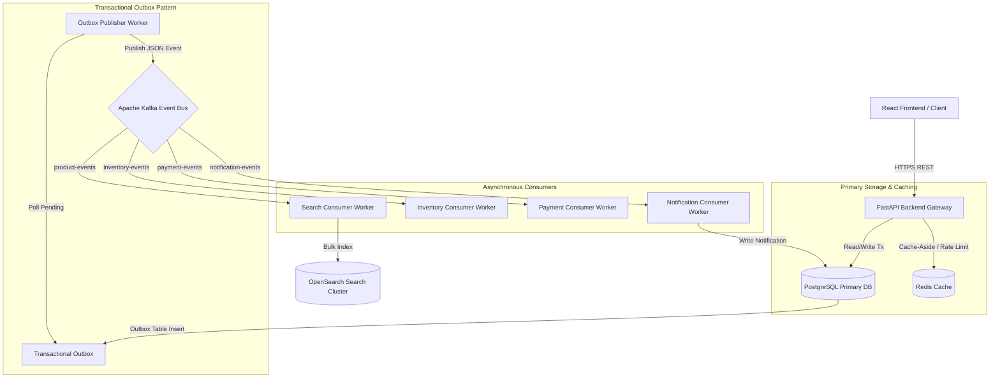

# Scalable E-Commerce Order & Product Search Platform

An enterprise-grade, distributed backend system built for high-scale e-commerce order processing, event-driven product search indexing, pessimistic inventory concurrency control, and transactional outbox event streaming.

Designed specifically as an **SDE Portfolio Project** demonstrating distributed systems fundamentals, ACID database transactions, OpenSearch indexing, Kafka asynchronous streaming, and fault-tolerant software engineering.

---

## High-Level Architecture



---

## Key Features

- **FastAPI REST API**: Async Python 3.12 backend with Pydantic validation, JWT authentication, and RBAC (`CUSTOMER`, `ADMIN`, `INVENTORY_MANAGER`).
- **OpenSearch Product Search**: Sub-20ms fuzzy full-text search with edge N-gram autocomplete, category/brand filters, price range sliders, and PostgreSQL fallback.
- **Inventory Concurrency Protection**: Pessimistic row-level locking (`SELECT FOR UPDATE`) guaranteeing **zero overselling** and stock $\ge 0$ during peak 100-thread concurrent purchases.
- **Transactional Outbox Pattern**: Ensures atomic database commit and event publishing to Kafka, eliminating dual-write vulnerabilities.
- **Idempotent Order Creation**: Mandatory `Idempotency-Key` header enforcement preventing duplicate orders.
- **Consumer Deduplication**: `processed_events` table checks ensuring consumer idempotency under at-least-once Kafka event delivery.
- **Top-K Min-Heap Analytics Engine**: $O(N \log K)$ sales analytics algorithm reducing processing overhead by 6x over standard database sorts.
- **Observability & Monitoring**: `/api/v1/health/ready` dependency inspector, Prometheus metrics (`/api/v1/metrics`), and Grafana dashboard configs.
- **React + Vite Dashboard**: Sleek glassmorphism UI for product search, shopping cart, idempotent checkout, order state machine tracking, and DLQ event inspection.

---

## Tech Stack & Engineering Rationale

| Technology | Purpose | Technical Rationale |
| :--- | :--- | :--- |
| **FastAPI / Python 3.12** | Core Backend | High performance async I/O, Pydantic type safety, auto OpenAPI generation |
| **PostgreSQL 16** | Primary Transactional DB | Strict ACID transactions, row-level locking (`SELECT FOR UPDATE`), check constraints |
| **Redis 7** | Cache & Rate Limiting | Sub-millisecond cache-aside reads and sliding window rate limiting |
| **OpenSearch 2.11** | Full-Text Search Cluster | Inverted index search with edge N-gram tokenizers for rapid filtering |
| **Apache Kafka 7.5.0** | Event Streaming Bus | Asynchronous decoupling, message durability, and scalable consumer groups |
| **React + TypeScript** | Web Dashboard | Simple, responsive UI demonstrating end-to-end integration |
| **Prometheus / Grafana** | Observability | Metrics collection for latency, order rate, outbox queue size, and cache hits |

---

## How to Run the Entire Project for $0

All required infrastructure runs locally using Docker containers. No paid cloud accounts or subscriptions are needed.

### Prerequisites
- Python 3.11+
- Node.js 18+
- Docker Desktop

### 1. Clone & Set Up Infrastructure
```bash
# Clone or navigate to the project folder
cd "C:\Users\SHIVA CHARAN\OneDrive\Desktop\E-Commerce"

# Copy environment file
cp .env.example .env

# Start local infrastructure (Postgres, Redis, Kafka, OpenSearch, Prometheus, Grafana)
docker compose up -d
```

### 2. Set Up Backend & Seed Data
```bash
# Create virtual environment & install dependencies
python -m venv venv
venv\Scripts\activate  # On Windows
pip install -r requirements.txt

# Run seed script (Creates 102 Users, 20 Categories, 1000+ Products with Inventory)
python backend/scripts/seed_data.py

# Create search index and bulk index products into OpenSearch
python backend/scripts/reindex_products.py

# Start FastAPI application server
uvicorn app.main:app --reload --port 8000
```

### 3. Start Background Workers (In separate terminal)
```bash
# Start Outbox Publisher worker
python backend/app/workers/outbox_publisher.py

# Start Search Consumer worker
python backend/app/workers/search_consumer.py
```

### 4. Start React Frontend (In separate terminal)
```bash
cd frontend
npm install
npm run dev
```
Open **http://localhost:3000** in your browser to view the application dashboard!
Open **http://localhost:8000/docs** for the interactive Swagger API documentation.

---

## Testing & Load Testing

### Run Pytest Test Suite
```bash
# Run unit, integration, and API tests
pytest backend/tests/ -v

# Run the 100-thread Inventory Concurrency Test
pytest backend/tests/concurrency/test_inventory_concurrency.py -v
```

### Run Locust Load Test
```bash
locust -f backend/tests/load/locustfile.py --host=http://localhost:8000
```

---

## Documentation Suite

Detailed system design specifications are available in the [`docs/`](file:///C:/Users/SHIVA%20CHARAN/OneDrive/Desktop/E-Commerce/docs/) directory:

- [Architecture & Diagrams](file:///C:/Users/SHIVA%20CHARAN/OneDrive/Desktop/E-Commerce/docs/architecture.md)
- [Database Design & EXPLAIN Queries](file:///C:/Users/SHIVA%20CHARAN/OneDrive/Desktop/E-Commerce/docs/database-design.md)
- [API Design Specification](file:///C:/Users/SHIVA%20CHARAN/OneDrive/Desktop/E-Commerce/docs/api-design.md)
- [Event-Driven Architecture & Outbox](file:///C:/Users/SHIVA%20CHARAN/OneDrive/Desktop/E-Commerce/docs/event-driven-design.md)
- [Caching & Rate Limiting Strategy](file:///C:/Users/SHIVA%20CHARAN/OneDrive/Desktop/E-Commerce/docs/caching.md)
- [Scalability & Bottlenecks](file:///C:/Users/SHIVA%20CHARAN/OneDrive/Desktop/E-Commerce/docs/scalability.md)
- [Failure Handling & DLQ](file:///C:/Users/SHIVA%20CHARAN/OneDrive/Desktop/E-Commerce/docs/failure-handling.md)
- [SDE Technical Interview Q&A Guide](file:///C:/Users/SHIVA%20CHARAN/OneDrive/Desktop/E-Commerce/docs/interview-guide.md)
- [AWS Cloud Deployment Guide](file:///C:/Users/SHIVA%20CHARAN/OneDrive/Desktop/E-Commerce/docs/aws-deployment.md)
- [Resume Summary & Bullet Points](file:///C:/Users/SHIVA%20CHARAN/OneDrive/Desktop/E-Commerce/docs/resume-project-summary.md)
