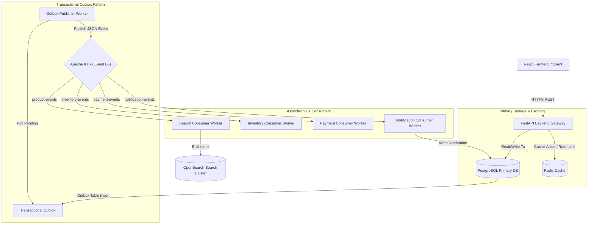
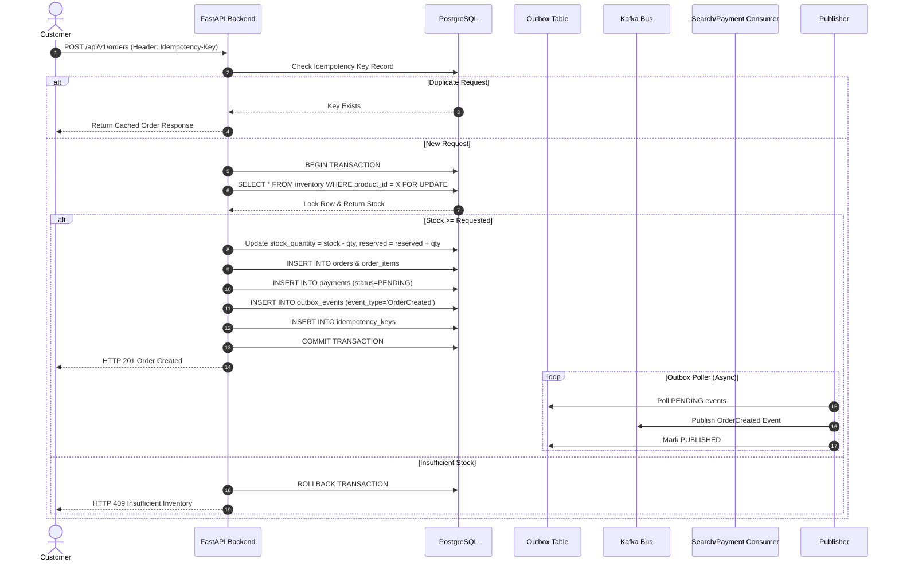
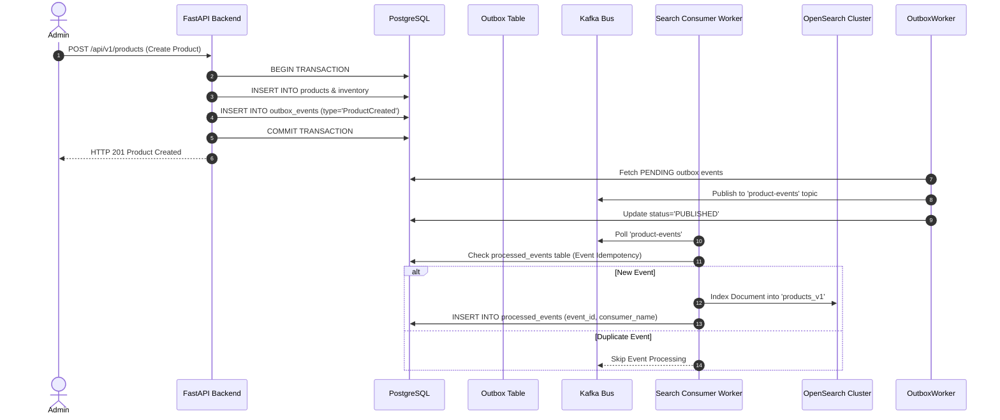
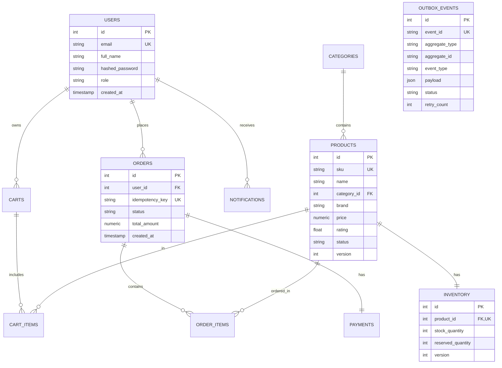

# System Architecture & Design Specification

## Overview

The **Scalable E-Commerce Order & Product Search Platform** is built as an event-driven, highly concurrent distributed system designed for SDE technical interviews. It prioritizes strong transaction isolation, inventory consistency, idempotent order processing, outbox event delivery, and sub-millisecond search performance using OpenSearch.

---

## High-Level System Architecture

---

## Order Placement & Inventory Concurrency Flow

---

## OpenSearch Event-Driven Sync Flow

---

## Entity Relationship Diagram (ERD)

